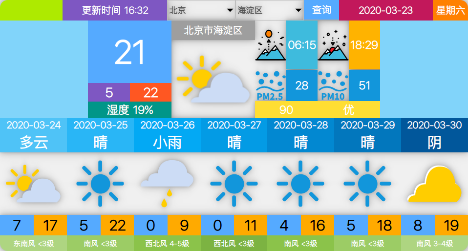
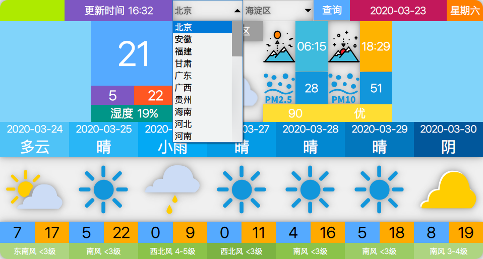
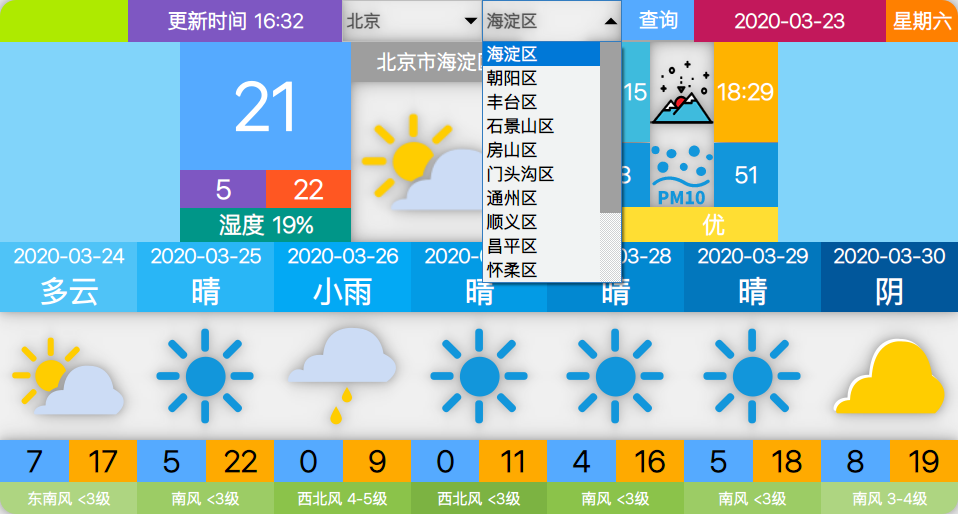
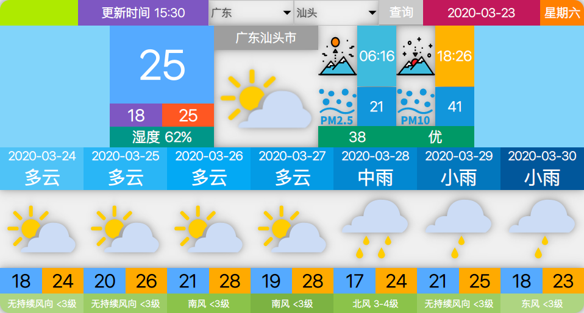
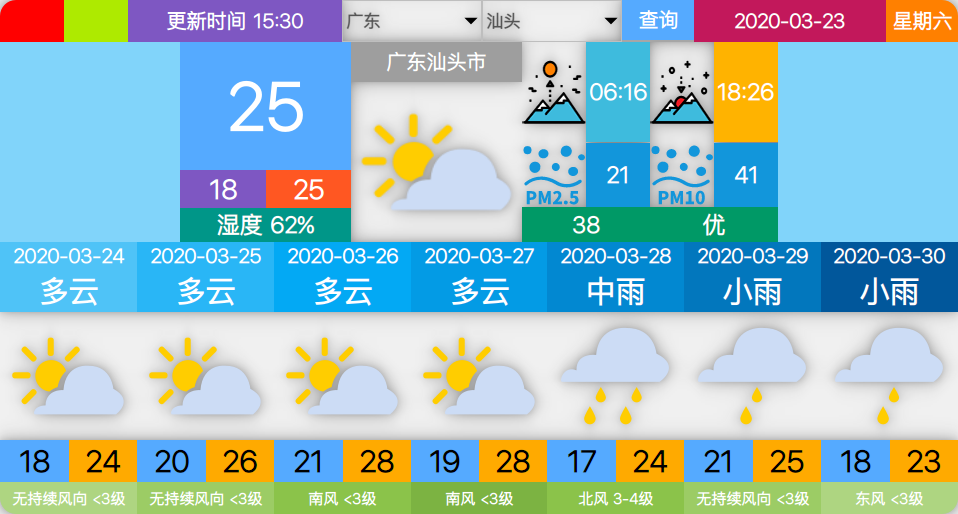
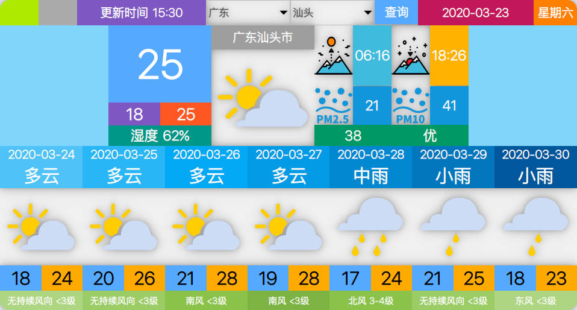
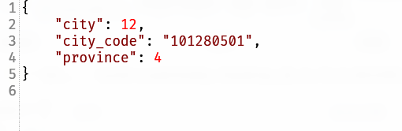
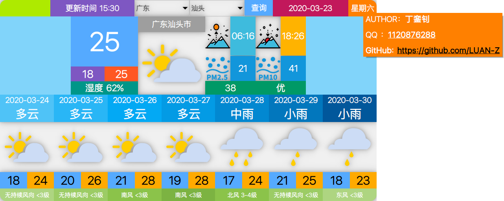

# LookTheSky

## 概览

**`LookTheSky`** 是一个基于`QT 14.0 `开发的天气查询应用，使用 [sojson](https://www.sojson.com/blog/305.html) 免费天气 API 接口进行天气数据的获取，该应用能查询全国各个省市的天气情况和7天内的基本天气。

- 打开应用直接查询天气
- 可以根据下拉框选择对应的省市
- 可以显示当天的天气信息与 7 天内的基本天气信息

- 本应用可以记录用户上次查询的城市，并在下次开启应用时直接查询上次保存的城市

## 使用方法

### 点击省份下拉框选择省份

### 点击城市下拉框选择省份对于的城市

### 点击查询按钮进行天气信息的获取并显示到应用上

### 左上角第一个按钮为关闭应用按钮

**点击按钮关闭应用**

### 左上角第二按钮为最小化按钮

**点击按钮将应用最小化到系统菜单栏**

## 其它

### 关于 `settings.json`

在应用运行会生成一个 `settings.json` 的文件，用于保存最近查询的城市信息，下次启动应用时会从该文件读取相应的省市信息并进行查询

- `city` 城市下拉框的序号

- `province` 省份下拉框的序号

- `city_code` [城市代码](https://github.com/baichengzhou/weather.api/blob/master/src/main/resources/citycode-2019-08-23.json)

  

###  关于作者

